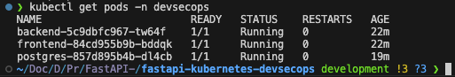
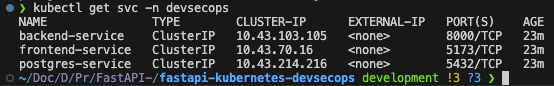
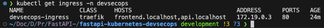
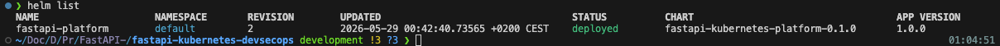
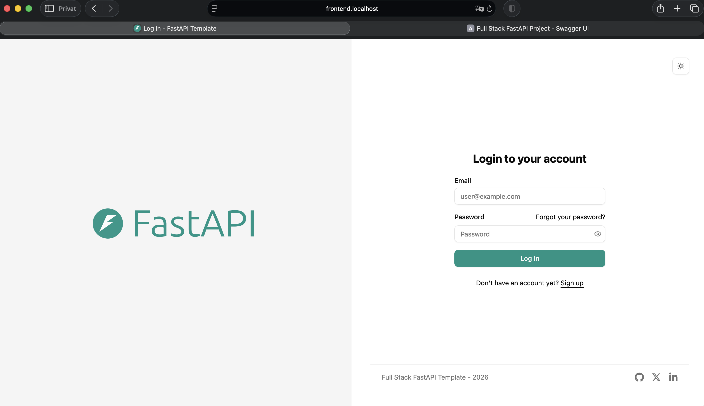
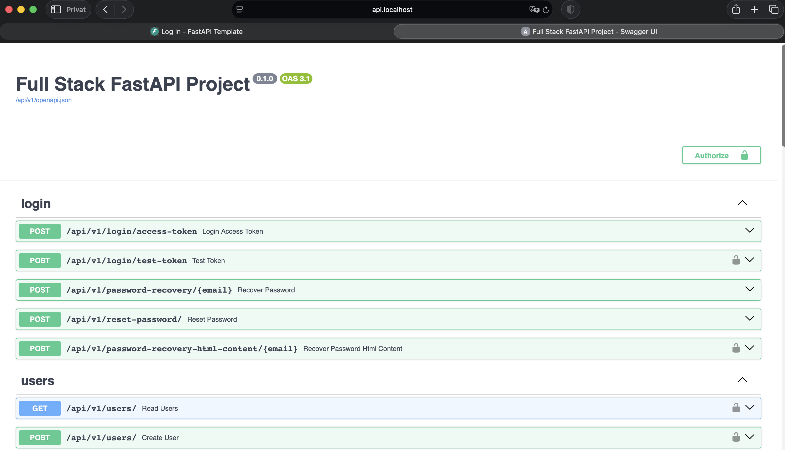

# FastAPI Kubernetes DevSecOps Platform

<p align="center">
  
</p>

A practical Kubernetes project that extends an existing FastAPI DevSecOps platform into a container-orchestrated deployment using **k3d**, **Kubernetes**, **Traefik Ingress**, **PostgreSQL**, **Helm**, and basic **Kubernetes security hardening**.

The goal of this project is not to build an over-engineered enterprise cluster. The goal is to show that the application can be deployed, configured, exposed, and managed in a realistic Kubernetes environment while keeping the setup understandable and reproducible.

---

## Table of Contents

- [Project Overview](#project-overview)
- [What This Project Demonstrates](#what-this-project-demonstrates)
- [What Is Kubernetes?](#what-is-kubernetes)
- [Why Kubernetes Was Added](#why-kubernetes-was-added)
- [Architecture](#architecture)
- [Tech Stack](#tech-stack)
- [Core Kubernetes Concepts Used](#core-kubernetes-concepts-used)
- [Repository Structure](#repository-structure)
- [Prerequisites](#prerequisites)
- [Local Kubernetes Cluster Setup](#local-kubernetes-cluster-setup)
- [Docker Images](#docker-images)
- [Kubernetes Manifests](#kubernetes-manifests)
- [Helm Deployment](#helm-deployment)
- [Ingress and Local URLs](#ingress-and-local-urls)
- [Security Hardening](#security-hardening)
- [Persistence](#persistence)
- [Useful Commands](#useful-commands)
- [Screenshots](#screenshots)
- [Troubleshooting Notes](#troubleshooting-notes)
- [What I Learned](#what-i-learned)
- [Disclaimer](#disclaimer)

---

## Project Overview

This repository is based on an existing FastAPI DevSecOps platform and adds a Kubernetes-based deployment layer on top of it.

The application consists of three main components:

- **Frontend** served through Nginx
- **Backend** built with FastAPI
- **PostgreSQL database** with persistent storage

Instead of running everything only with Docker Compose, the application is deployed into a local Kubernetes cluster using k3d. The project includes Kubernetes manifests and a Helm chart to make the deployment reusable and easier to manage.

The final result is a local Kubernetes environment where the frontend, backend, and database run as separate workloads and communicate through Kubernetes services.

---

## What This Project Demonstrates

This project demonstrates practical knowledge of:

- Containerized application deployment
- Kubernetes workloads and networking
- Local cluster management with k3d
- Service discovery inside Kubernetes
- Ingress routing with Traefik
- ConfigMaps and Secrets
- Persistent storage for PostgreSQL
- Helm chart packaging
- Basic security hardening for Kubernetes workloads
- Health checks with readiness and liveness probes
- Resource requests and limits

---

## What Is Kubernetes?

Kubernetes is a system for managing containers.

With Docker Compose, containers are usually started directly on one machine:

```text
Docker Compose
├── frontend
├── backend
└── postgres
```

This works well for local development. However, Docker Compose is limited when an application needs to scale, recover from failures, or run across multiple machines.

Kubernetes solves this by acting as a **container orchestrator**.

That means Kubernetes can:

- Start containers
- Restart failed containers
- Expose applications through services
- Store configuration separately from application code
- Manage secrets
- Scale workloads
- Route traffic
- Attach persistent storage
- Monitor if applications are healthy

A simple way to understand Kubernetes:

> Docker runs containers. Kubernetes manages containers.

In this project, Kubernetes is used to run the frontend, backend, and PostgreSQL database in a structured and reproducible way.

---

## Why Kubernetes Was Added

The original project already had a strong DevSecOps foundation with containerization and security tooling. Kubernetes was added as the next infrastructure layer to make the project more realistic for modern DevOps, DevSecOps, and cloud-native environments.

The goal was to learn and demonstrate how an application can move from a Docker-based setup to a Kubernetes-based setup.

The Kubernetes setup adds:

- Better separation between application components
- Internal networking through Kubernetes services
- Config and secret management
- Persistent database storage
- Ingress routing through Traefik
- Health checks
- Resource control
- Helm-based deployment

---

## Architecture

High-level architecture:

```text
Browser
  │
  ▼
Traefik Ingress
  │
  ├── frontend.localhost ──► frontend-service ──► frontend pod
  │
  └── api.localhost ──────► backend-service ───► backend pod
                                      │
                                      ▼
                              postgres-service
                                      │
                                      ▼
                                postgres pod
                                      │
                                      ▼
                              Persistent Volume
```

Inside the Kubernetes cluster:

```text
Namespace: devsecops

├── Backend Deployment
│   └── FastAPI backend pod
│
├── Frontend Deployment
│   └── Nginx frontend pod
│
├── PostgreSQL Deployment
│   └── PostgreSQL pod
│
├── Services
│   ├── backend-service
│   ├── frontend-service
│   └── postgres-service
│
├── ConfigMap
│   └── non-sensitive backend configuration
│
├── Secret
│   └── sensitive backend values
│
├── PersistentVolumeClaim
│   └── PostgreSQL storage
│
└── Ingress
    └── Traefik routing for local URLs
```

---

## Tech Stack

| Technology | Purpose |
|---|---|
| FastAPI | Backend API |
| PostgreSQL | Database |
| Nginx | Serves the frontend build |
| Docker | Builds application images |
| Kubernetes | Container orchestration |
| k3d | Local Kubernetes cluster using Docker |
| k3s | Lightweight Kubernetes distribution used by k3d |
| kubectl | CLI tool to interact with Kubernetes |
| Traefik | Ingress controller and reverse proxy |
| Helm | Kubernetes package manager |
| ConfigMap | Non-sensitive configuration |
| Secret | Sensitive configuration |
| PersistentVolumeClaim | Persistent database storage |

---

## Core Kubernetes Concepts Used

### Cluster

A Kubernetes cluster is the environment where workloads run.

In this project, the cluster is created locally with k3d:

```bash
k3d cluster create devsecops-cluster \
  -p "80:80@loadbalancer" \
  -p "443:443@loadbalancer"
```

This creates a local Kubernetes cluster that runs inside Docker.

---

### Node

A node is a machine that runs Kubernetes workloads.

In this local setup, k3d creates a Kubernetes node inside Docker.

Example:

```bash
kubectl get nodes
```

---

### Namespace

A namespace is used to logically separate Kubernetes resources.

This project uses:

```text
devsecops
```

All application resources are deployed into this namespace.

---

### Pod

A pod is the smallest deployable unit in Kubernetes.

Usually, one pod contains one application container.

In this project:

```text
backend pod   -> FastAPI container
frontend pod  -> Nginx container
postgres pod  -> PostgreSQL container
```

---

### Deployment

A Deployment tells Kubernetes how to run an application.

It defines:

- Which image to use
- How many replicas to run
- Which ports to expose inside the pod
- Health checks
- Resource limits
- Security settings

If a pod crashes, the Deployment ensures that Kubernetes starts a new one.

---

### Service

Pods can change their internal IP address. A Service gives them a stable network address.

In this project:

```text
backend-service
frontend-service
postgres-service
```

The backend connects to PostgreSQL through:

```text
postgres-service
```

This is important because `localhost` inside a pod means the pod itself, not another container.

---

### ConfigMap

A ConfigMap stores non-sensitive configuration.

Examples:

```text
PROJECT_NAME
ENVIRONMENT
POSTGRES_SERVER
POSTGRES_PORT
BACKEND_CORS_ORIGINS
```

This keeps configuration separate from the container image.

---

### Secret

A Secret stores sensitive values.

Examples:

```text
SECRET_KEY
POSTGRES_PASSWORD
FIRST_SUPERUSER_PASSWORD
SMTP_PASSWORD
```

For local development, placeholder values are used. In production, these values should be replaced with strong secrets and managed securely.

---

### PersistentVolumeClaim

A PersistentVolumeClaim is used to request storage for a pod.

PostgreSQL needs persistent storage because database data should not disappear when the pod restarts.

This project uses a PVC for PostgreSQL data.

---

### Ingress

Ingress exposes services through HTTP routes.

Instead of using port-forwarding, Traefik routes traffic to the correct service.

This project uses:

```text
http://frontend.localhost
http://api.localhost/docs
```

---

### Helm

Helm is the package manager for Kubernetes.

Instead of applying many YAML files manually, Helm packages them into a chart.

With Helm, the whole platform can be installed or upgraded with one command.

---

## Repository Structure

Example structure:

```text
.
├── backend/
├── frontend/
├── k8s/
│   ├── namespace.yaml
│   ├── backend-configmap.yaml
│   ├── backend-secret.yaml
│   ├── backend-deployment.yaml
│   ├── backend-service.yaml
│   ├── frontend-deployment.yaml
│   ├── frontend-service.yaml
│   ├── postgres-deployment.yaml
│   ├── postgres-service.yaml
│   ├── postgres-pvc.yaml
│   └── ingress.yaml
│
├── helm/
│   └── fastapi-kubernetes-platform/
│       ├── Chart.yaml
│       ├── values.yaml
│       └── templates/
│           ├── namespace.yaml
│           ├── backend-configmap.yaml
│           ├── backend-secret.yaml
│           ├── backend-deployment.yaml
│           ├── backend-service.yaml
│           ├── frontend-deployment.yaml
│           ├── frontend-service.yaml
│           ├── postgres-deployment.yaml
│           ├── postgres-service.yaml
│           ├── postgres-pvc.yaml
│           └── ingress.yaml
│
└── README.md
```

---

## Prerequisites

Required tools:

- Docker Desktop
- kubectl
- k3d
- Helm
- Git

Check versions:

```bash
docker --version
kubectl version --client
k3d version
helm version
```

Install k3d with Homebrew:

```bash
brew install k3d
```

Install Helm with Homebrew:

```bash
brew install helm
```

---

## Local Kubernetes Cluster Setup

Create a local k3d cluster:

```bash
k3d cluster create devsecops-cluster \
  -p "80:80@loadbalancer" \
  -p "443:443@loadbalancer"
```

The port mapping is important because Traefik should be reachable directly through the browser without using port-forwarding.

Check if the cluster is running:

```bash
kubectl get nodes
```

Expected result:

```text
NAME                             STATUS   ROLES                  VERSION
k3d-devsecops-cluster-server-0   Ready    control-plane,master   ...
```

---

## Docker Images

The Kubernetes cluster needs container images for the backend and frontend.

Build the backend image:

```bash
docker build -t backend:latest -f backend/Dockerfile .
```

Build the frontend image:

```bash
docker build -t frontend:latest -f frontend/Dockerfile .
```

Import the images into the k3d cluster:

```bash
k3d image import backend:latest -c devsecops-cluster
k3d image import frontend:latest -c devsecops-cluster
```

This is needed because the cluster runs inside Docker and does not automatically know every local image from the host system.

---

## Kubernetes Manifests

The `k8s/` directory contains raw Kubernetes YAML files.

These files can be applied manually:

```bash
kubectl apply -f k8s/namespace.yaml
kubectl apply -f k8s/backend-configmap.yaml
kubectl apply -f k8s/backend-secret.yaml
kubectl apply -f k8s/postgres-pvc.yaml
kubectl apply -f k8s/postgres-deployment.yaml
kubectl apply -f k8s/postgres-service.yaml
kubectl apply -f k8s/backend-deployment.yaml
kubectl apply -f k8s/backend-service.yaml
kubectl apply -f k8s/frontend-deployment.yaml
kubectl apply -f k8s/frontend-service.yaml
kubectl apply -f k8s/ingress.yaml
```

However, the preferred deployment method for this project is Helm.

---

## Helm Deployment

The Helm chart is located here:

```text
helm/fastapi-kubernetes-platform/
```

### Validate the Chart

```bash
helm lint ./helm/fastapi-kubernetes-platform
```

Expected result:

```text
1 chart(s) linted, 0 chart(s) failed
```

### Install the Application

```bash
helm install fastapi-platform ./helm/fastapi-kubernetes-platform
```

### Upgrade the Application

After changing templates or values:

```bash
helm upgrade fastapi-platform ./helm/fastapi-kubernetes-platform
```

### List Helm Releases

```bash
helm list
```

### Uninstall the Release

```bash
helm uninstall fastapi-platform
```

If the namespace should also be removed:

```bash
kubectl delete namespace devsecops
```

---

## Ingress and Local URLs

Traefik is used as the Ingress controller.

The local URLs are:

```text
http://frontend.localhost
http://api.localhost/docs
```

The Ingress routes traffic like this:

```text
frontend.localhost -> frontend-service -> frontend pod
api.localhost      -> backend-service  -> backend pod
```

Check the Ingress:

```bash
kubectl get ingress -n devsecops
```

---

## Security Hardening

This project includes basic Kubernetes security hardening.

### Non-root Containers

The backend and frontend containers run as non-root users.

Backend example:

```yaml
securityContext:
  runAsNonRoot: true
  runAsUser: 10001
  runAsGroup: 10001
  allowPrivilegeEscalation: false
```

Frontend example:

```yaml
securityContext:
  runAsNonRoot: true
  runAsUser: 101
  runAsGroup: 101
  allowPrivilegeEscalation: false
```

This reduces the risk if a container is compromised.

### Resource Requests and Limits

Resource requests and limits are configured for backend, frontend, and PostgreSQL.

This prevents containers from consuming unlimited CPU or memory.

Example:

```yaml
resources:
  requests:
    memory: "128Mi"
    cpu: "100m"
  limits:
    memory: "512Mi"
    cpu: "500m"
```

### Readiness and Liveness Probes

Health checks are used to let Kubernetes know whether a container is ready and healthy.

- **Readiness probe**: decides if the pod should receive traffic
- **Liveness probe**: decides if the pod should be restarted

Backend uses HTTP probes.
Frontend uses HTTP probes.
PostgreSQL uses TCP probes.

### ConfigMap and Secret Separation

Non-sensitive configuration is stored in a ConfigMap.
Sensitive values are stored in a Secret.

This follows a cleaner DevSecOps approach than hardcoding everything inside application code.

---

## Persistence

PostgreSQL uses a PersistentVolumeClaim.

This means the database data can survive pod restarts.

Check PVC status:

```bash
kubectl get pvc -n devsecops
```

Expected result:

```text
postgres-pvc   Bound
```

---

## Useful Commands

Check all pods:

```bash
kubectl get pods -n devsecops
```

Check services:

```bash
kubectl get svc -n devsecops
```

Check ingress:

```bash
kubectl get ingress -n devsecops
```

Check Helm releases:

```bash
helm list
```

View backend logs:

```bash
kubectl logs -n devsecops deployment/backend
```

View frontend logs:

```bash
kubectl logs -n devsecops deployment/frontend
```

View PostgreSQL logs:

```bash
kubectl logs -n devsecops deployment/postgres
```

Restart a deployment:

```bash
kubectl rollout restart deployment/backend -n devsecops
```

Check rollout status:

```bash
kubectl rollout status deployment/backend -n devsecops
```

Describe a pod:

```bash
kubectl describe pod <pod-name> -n devsecops
```

---

## Screenshots

Add screenshots of the running Kubernetes setup here.

Recommended screenshots:

### 1. Kubernetes Pods

Command:

```bash
kubectl get pods -n devsecops
```

Suggested image:



### 2. Kubernetes Services

Command:

```bash
kubectl get svc -n devsecops
```

Suggested image:



### 3. Kubernetes Ingress

Command:

```bash
kubectl get ingress -n devsecops
```

Suggested image:



### 4. Helm Release

Command:

```bash
helm list
```

Suggested image:



### 5. Frontend

URL:

```text
http://frontend.localhost
```

Suggested image:



### 6. Backend API Docs

URL:

```text
http://api.localhost/docs
```

Suggested image:



---

## What I Learned

Through this project, I learned how Kubernetes changes the way containerized applications are deployed and managed.

The most important learning points were:

- `kubectl` is the CLI used to communicate with Kubernetes
- k3d can create a lightweight local Kubernetes cluster using Docker
- Kubernetes does not run source code directly; it runs container images
- Pods are the smallest running units in Kubernetes
- Deployments keep pods running and replace failed pods automatically
- Services provide stable internal networking
- `localhost` inside a pod does not mean the host machine or another pod
- ConfigMaps and Secrets separate configuration from application code
- PostgreSQL needs persistent storage through a PVC
- Ingress exposes services through clean local URLs
- Helm packages Kubernetes resources into a reusable chart
- Security hardening can be added through non-root users, resource limits, and health checks

The project helped me understand the difference between simply running containers and managing containerized infrastructure.

---

## Disclaimer

This project is intended for learning and portfolio purposes.

The local secrets and placeholder passwords are used only for local development. In a real production environment, secrets must be replaced with strong values and managed using a secure secret management solution.